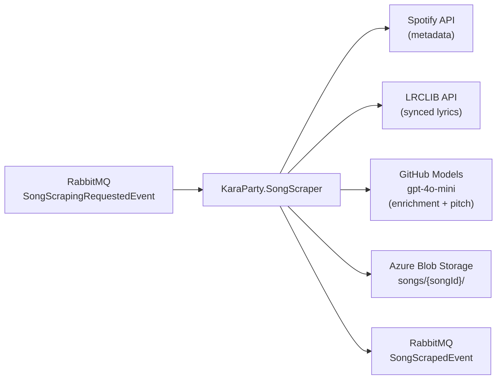

# KaraParty.SongScraper

A .NET 10 worker service that consumes song scraping requests from RabbitMQ, enriches them using Spotify, LRCLIB, and AI, uploads the results to Azure Blob Storage, and publishes a completion event back to the API.

---

## Pipeline



---

## What it produces

For each song, three files are uploaded to `songs/{songId}/`:

| File | Contents |
|---|---|
| `lyrics.lrc` | Raw LRC file (timestamped lyrics) |
| `lyrics.json` | Parsed LRC lines — `[ { timestampSeconds, text } ]` |
| `pitch.json` | Pitch reference — `[ { t, note, hz } ]` |

The `SongScrapedEvent` published after upload includes all enriched metadata plus the blob paths, allowing the API to mark the song as `Available`.

---

## Services

| Service | Responsibility |
|---|---|
| `SpotifyService` | Fetch track metadata (title, artist, album, duration, cover) via Spotify API |
| `LrcLibService` | Fetch synced lyrics in LRC format from LRCLIB |
| `AiEnrichmentService` | Analyze lyrics for language, mood, genre, karaoke difficulty, summary, and pitch reference |
| `SongScraperService` | Orchestrate the three services above into a single `SongResult` |
| `BlobUploadService` | Upload `lyrics.lrc`, `lyrics.json`, `pitch.json` to Azure Blob Storage |
| `SongScrapingRequestedConsumer` | MassTransit consumer — entry point for the pipeline |

---

## Configuration

| Key | Description |
|---|---|
| `Spotify:ClientId` | Spotify app client ID |
| `Spotify:ClientSecret` | Spotify app client secret |
| `GitHubModels:Token` | GitHub personal access token (for Azure inference endpoint) |
| `GitHubModels:Endpoint` | `https://models.inference.ai.azure.com` |
| `GitHubModels:Model` | e.g. `gpt-4o-mini` |
| `RabbitMQ:Host` | RabbitMQ hostname (default: `localhost`) |
| `RabbitMQ:Username` / `Password` | RabbitMQ credentials |
| `ConnectionStrings:BlobStorage` | Azure Blob Storage connection string |
| `Blob:SongsContainer` | Container name (default: `songs`) |

Secrets (`Spotify:ClientId`, `Spotify:ClientSecret`, `GitHubModels:Token`, `ConnectionStrings:BlobStorage`) should be stored in **User Secrets** in development.

---

## Running

```bash
# Start RabbitMQ
docker run -d --name rabbitmq -p 5672:5672 -p 15672:15672 rabbitmq:management

# Run the scraper
cd D:\Projects\genai
dotnet run --project KaraParty.SongScraper
```

The worker runs indefinitely, consuming `SongScrapingRequestedEvent` messages as they arrive.

---

## See also

- [Song Ingestion Pipeline — full docs](../../karaparty-be/karaparty/docs/song-ingestion.md)
